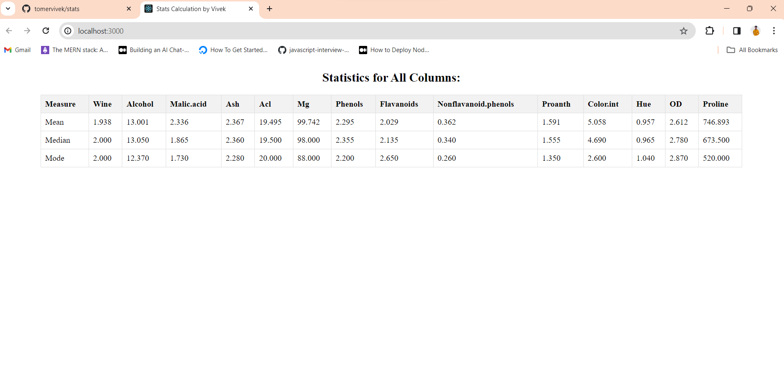

How to run the repository:-
1. Clone Repository  
git clone https://github.com/tomervivek/stats.git

2. Move to Repository  
cd stats

3. Install required dependencies
yarn install

4. Run local server
yarn start

output will be :-

